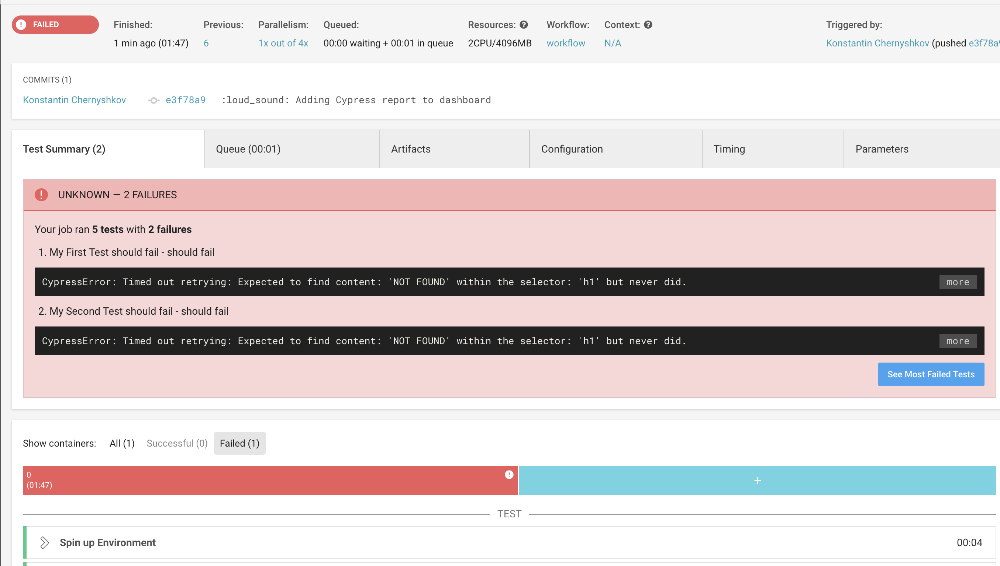
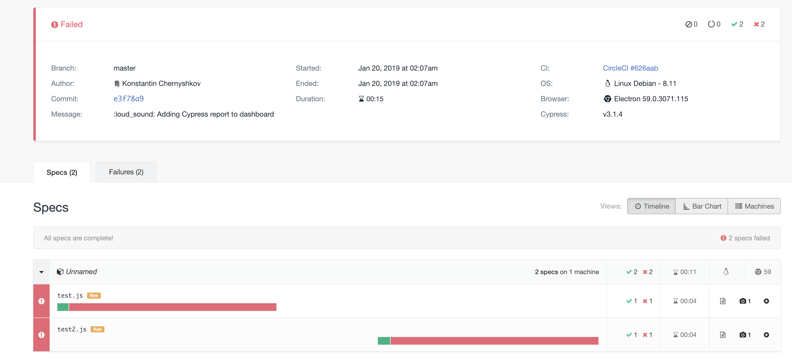

# The example of integration Vue + Jest + Cypress + Circle 
[](https://circleci.com/gh/kcrebound/vue-circleci-example)

## Features
* Jest with JUnit reports for pretty view failed tests in CircleCI
* Cypress with JUnit reports (each test will generate separate XML using `[hash]` in the name of a report file)

* Video and screenshots uploaded to awesome https://dashboard.cypress.io 


##  Reference list
https://github.com/cypress-io/cypress-example-docker-circle


## Using

```
npm run ci:unit
npm run ci:e2e
```
